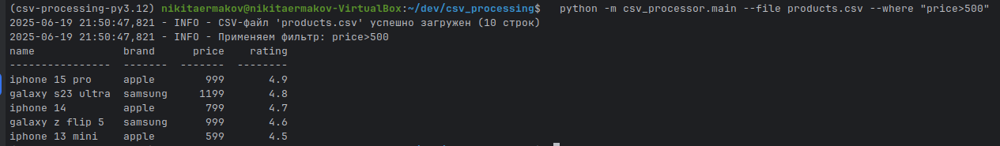
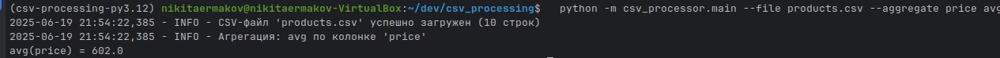
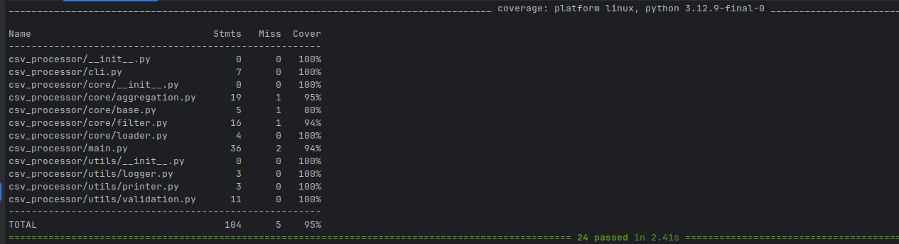

## CSV Processor

### Запуск
```bash
  pip install -r requirements.txt
```
---

### Использование
```bash
  python -m csv_processor.main --file <путь_к_файлу.csv> [--where "условие"] [--aggregate колонка операция]
```
### Примеры запуска

Фильтрация по цене больше 500:
```bash
  python -m csv_processor.main --file products.csv --where "price>500"
```


Агрегация: среднее значение цены
```bash
  python -m csv_processor.main --file products.csv --aggregate price avg
```


---

### Тестирование

Запуск тестов с покрытием:
```bash
  PYTHONPATH=. pytest --cov=csv_processor tests/
```


---